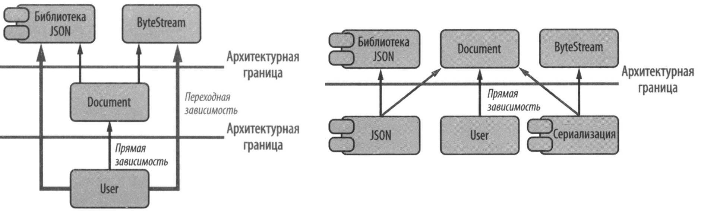
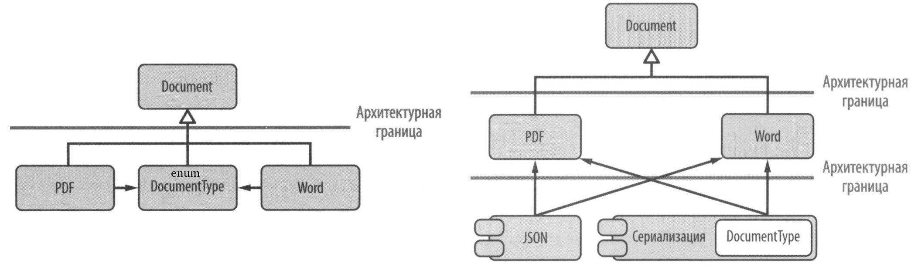
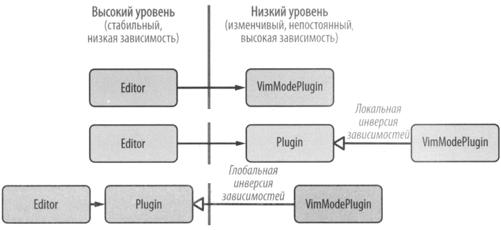

# Паттерны проектирования с примерами на C++

## Базовые принципы проектирования

### Минимизация зависимостей
**Проектирование** – искусство управления зависимостями. 
Главная цель – сведение к минимуму зависимостей (особенно искусственных). 
Для её достижения, можно использовать [паттерны проектирования](#паттерны-проектирования).

### Разделение ответсвенности 
Разделение ответсвенности позволяет проектировать структуры более простыми для понимания, изменения и тестирования. 
[Паттерны проектирования](#паттерны-проектирования) предоставляют способ разделения ответсвенности.
Основное различие между паттернами – это то, как они разделяют ответсвенность.

### Копмпозиция и наследование
Наследование это довольно сильный механизм, но стоит отдавать предпочтение композиции.
Например, паттерн [стратегия](#strategy) базируется на композиции для разделения ответсвенности, но так же использует наследование для расширения функциональности.
То же самое верно для паттернов [мост](#bridge), [адаптер](#adapter), [декоратор](#decorator), [внешний полиморфизм](#external-polymorphism) и [затирание типов](#туре-erasure).

### Неинтрузивное проектирование
Гибкость и расширяемость возникает, когда при добавлении нового функционала не приходится изменять существующий код, а просто добавляется новый.
Т.е. любое неинтрузивное проектирование предпочтительнее проектированию, которое интрузивно изменяет существующий код.
Например, паттерны: [декоратор](#decorator), [адаптер](#adapter), [внешний полиморфизм](#external-polymorphism) и [затирание типов](#туре-erasure). 

### Семантика значения
Код становится более простым и понятным, если предпочесть **значения** указателям и ссылкам.
С++ отлично поддерживает с семантикой значений.
На примере **std::variant** и [затирания типов](#туре-erasure), этот подход не всегда оказывает негативное влияние на производительность, а может даже и повысить ее.

## Принципы SOLID

### SRP – single responibility principle
У класса должна быть только одна причина для изменения (Р. Мартин). \
Прагматичные программисты рекомендуют разделять *ортогональные* асперкты ПО (Д. Томас, Э. Хант). \
*Связанность* – мера силы связи элементов внутри модуля, элементы с высокой степенью связанности следует рассматривать как единое целое (Том ДеМарко). \
Разделять ответсвенность помогают различные паттерны ([Посетитель](#visitor), [Стратегия](#strategy), [Внешний полиморфизм](#external-polymorphism)), 
их объединяет свойство вводить какую-то абстракцию, помогающую уменьшить количество зависимостей.

### OCP – open-closed principle
Программные артефакты должны быть открыты для расширения, и закрыты для изменения (Б. Майер). \
Некоторые считают OCP не отдельным принципом, а тем же, что и SRP. 
OCP больше касается расширения, т.е. что именно и как мы хотим расширить.
Важно понимать, как будет расширяться ПО, определить *точки вариации* и инкапсулировать их.

### LSP – Liskov substitution principle
Частный тип должен иметь возможность свободно заменять общий (формулирует отношение **IS-A**). \
Пример: circle–ellipse problem.
  - *инварианты* базового типа должны быть сохранены в производном типе
  - *предусловия* не должны быть усилены в производном типе
  - *постусловия* не должны быть ослаблены в производном типе
  - возвращаемые значениям методов должны быть *контравариантными*
  - параметры методов должны быть *ковариантными*

Изменение типа:
  - **ковариантно к генерализации**, когда выполняется условие: если **A** обобщает **B**, то **A'** обобщает **B'**
  - **контравариантно к генерализации**: если **A** обобщает **B**, то **B'** обобщает **A'**
  - **инвариантно к генерализации**: если **A** обобщает **B**, а между **A'** и **B'** нет никакой зависимости

### ISP – interface segregation principle
Клиенты не должны зависеть от методов, которые они не используют (Р. Мартин). \
ISP это частный случай SRP сосредоточенный на интерфейсах.

### DIP – dependency inversion principle
Высокоуровневые классы не должны зависеть от низкоуровневых, оба должны зависеть от абстракций.

## Паттерны проектирования

### Visitor
Позволяет расширить операции над закрытым набором типов
  - принцип OCP имеет [два аспекта](src/visitor/op_or_types) и необходимо сделать выбор в пользу одного из них – 
    либо легко добавлять типы (фиксируя число операций) – **ООП решение**, 
    либо легко добавлять операции (фиксируя количество типов) – **процедурное решение**.
  - [класическая реализация](src/visitor/classic) – обходное решение ООП для сложности добавления операций.
  - реализация на основе [шаблонного класса **std::variant**](src/visitor/variant).
  - [ацеклический посетитель](src/visitor/acyclic) позволяет одновременно расширять и **операции** и **типы** (в ущерб производительности)

### Strategy
Позволяет настроить поведение и "внедрить" его извне \
(также известный как **проектирование на основе политик**).

### Command
Позволяет абстрагироваться от различных видов операций (возможно отменяемых)

### Observer
Позволяет наблюдать за изменением состояния в некоторых сущностях.

### Adapter
Позволяет адаптировать один интерфейс к другому, неинтрузивно и без изменения кода.

### CRTP
Позволяет использовать статическую абстракцию, свободную от виртуальных функций (если не недоступны концепты С++20).
Также может быть полезным для создания классов-примесей времени компиляции.

### Bridge
Позволяет скрыть детали реализации и уменьшить физические зависимости.

### Prototype
Позволяет создать виртуальную копию объекта.

### External Polymorphism
Позволяет обеспечить слабую связанность за счет внешнего полиморфного поведения.

### Туре Erasure
Позвляет использовать мощь [Внешнего полиморфизма](#external-polymorphism) в сочетании с преимуществами [семантики значений](#семантика-значения-и-семантика-ссылок).

### Decorator
Позволяет ненавязчиво добавить обязанности к объекту.

