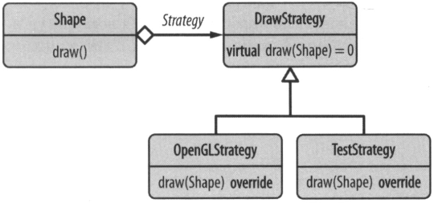

# Strategy (Стратегия)

## Классическая реализация 
Изолируя аспект рисования, мы можем изменять реализация рисования (SRP) 
без необходимости редактирования классов фигур (OCP). 
Классы конкретных фигур, теперь ожидают указатель на стратегию рисования.
Это позволяет настраивать поведение извне (**внедрение зависимости**).

## Проектирование на основе политик
Паттерн не ограничивается динамическим полиморфизмом, 
может быть реализован с использованием шаблонов (статический полиморфизм).
Т.е. стратегия передается не с помощью **unique_ptr**, а с помощью параметра шаблона.
Благодаря чему увеличится производительность, из-за уменьшения количества косвенных вызовов.

