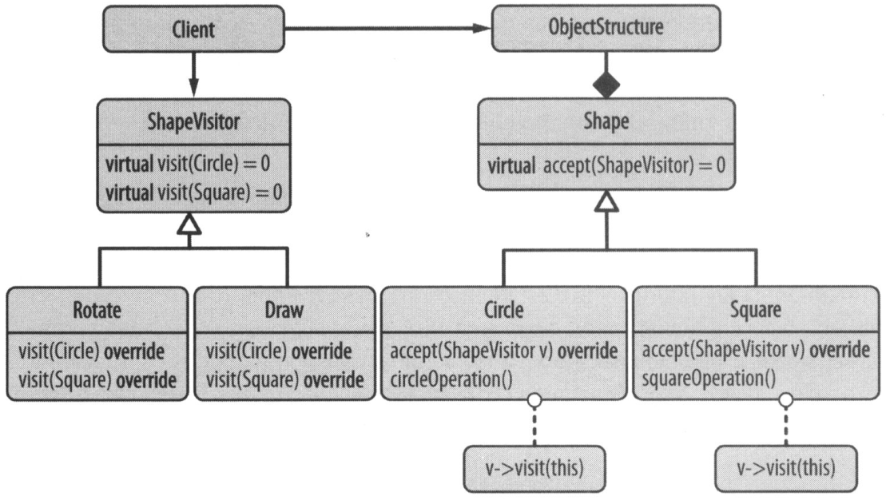
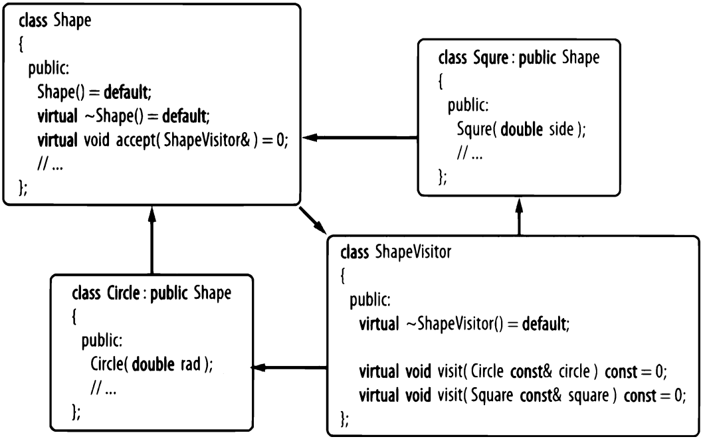

# Visitor (Посетитель)

## Классическая реализация (циклическая)
**Посетитель** позволяет определить новую операцию без изменения классов объектов (GoF). \
Класс **ShapeVisitor** содержит по одной виртуальной функии *visit* для каждого объекта фигуры. 
Эта реализация выполняет OCP в отношении добавления операций (*точка вариации*). 
А извлекая *точку вариации* в отдельный класс – выполняет SRP.

Реализация требует **закрытого набора** типов, предоставляет взамен **открытый набор** операций.
Основная причина этого ограничения – *циклическая зависимость* между **ShapeVisitor**, **конкретными фигурами** и классом **Shape**.

Недостатки:
  - негибкая модификация в обеих иерархиях (*циклическая* связть)
  - плохая производительность (два уровня указателй на функцию)
  - навязчивость – добавление *accept* в каждый конкретный тип (фигуру)
