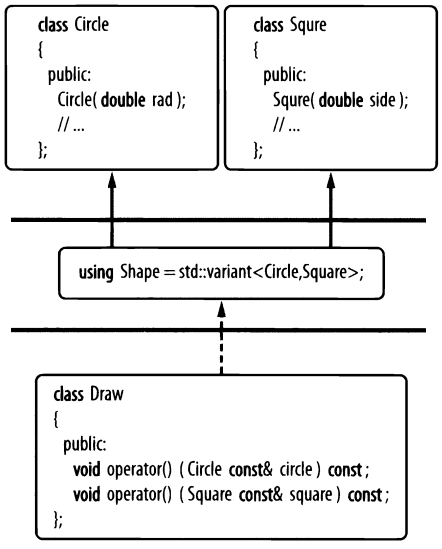

# Visitor (Посетитель)

## Реализация на основе шаблонного класса **std::variant**
**Посетитель** позволяет определить новую операцию без изменения классов объектов (GoF).

Это решение имеет гибкую реализацию и слабую зависимость: 
  - объекта фигур значительно упрощены (нет базового класса **Shape**)
  - нет необходимости реализовывать виртуальные функции (например, *accept*)
  - не является *навязчивым* (легко добавлять к существующим классам)
  - можно использовать *семантику значения* и отказаться от указателей на базовый класс
  - отсутсвуют циклические зависимости

Все так же можно легко добавлять новые операции, без редактирования существующего кода (OCP)

